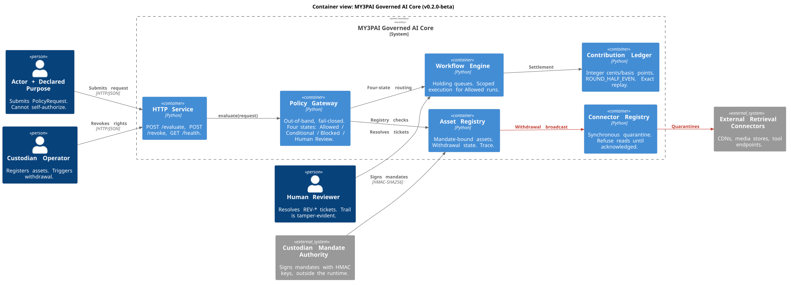
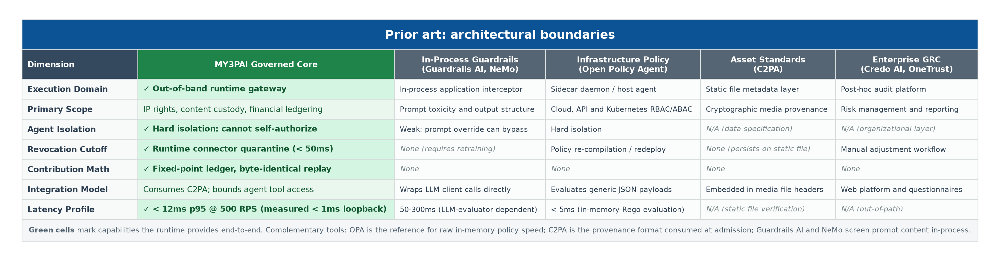

# MY3PAI Governed AI Core

[](https://github.com/kavehs87/MY3PAI-Governed-AI-Core/actions/workflows/ci.yml)
[](evidence/benchmarks/coverage.json)
[](pyproject.toml)
[](LICENSE)

An out-of-band policy gateway and execution runtime for rights-aware AI workflows, cryptographic provenance, and deterministic contribution accounting.

---

## Overview

Most AI guardrails operate inside the model's prompt context or as in-process middleware. This makes them vulnerable to prompt injection, agent bypass, and state drift.

`my3pai-governed-ai-core` enforces a decoupled, fail-closed state machine outside the agent's execution context. Autonomous models cannot self-authorize, modify permission tokens, or alter financial ledgers.

```text
Actor + Declared Purpose
        │
        ▼
┌───────────────────────────────┐
│     Four-State Gateway        │ ──► [Revocation Cutoff] ──► Instant Quarantine
└───────────────────────────────┘
        │
        ├── Allowed       ──► Scoped execution context ──► Fixed-Point Ledger
        ├── Conditional   ──► Holding queue (awaits prerequisites)
        ├── Human Review  ──► Audited ticket queue (EU AI Act Art. 14)
        └── Blocked       ──► Terminal reject (immutable trace recorded)
```

### Core Invariants

* **Fail-Closed Evaluation:** Ambiguous mandates, unverified assets, or unacknowledged connectors default strictly to `Blocked` or `Human Review`.
* **Zero Floating-Point Financials:** Ledger balances and revenue splits use exact fixed-point basis points (`ROUND_HALF_EVEN`), ensuring zero drift across independent recomputations.
* **Synchronous Revocation:** Withdrawing an asset instantly revokes token validity and quarantines connected data sources in < 50ms.

---

## Quickstart

### 1. Minimal Python Usage

```python
import hashlib
from datetime import datetime, timedelta, timezone

from schemas.asset import AssetMetadata
from schemas.policy import PolicyRequest, PolicyState
from src.policy.gateway import PolicyGateway
from src.policy.tokens import ConsentTokenStore
from src.records.mandate import sign_mandate
from src.records.store import AssetStore

custodian_key = hashlib.sha256(b"custodian-key").digest()
store = AssetStore()
gateway = PolicyGateway(
    store,
    ConsentTokenStore(hashlib.sha256(b"token-key").digest()),
    {"custodian-acme": custodian_key},
)

now = datetime.now(timezone.utc)
asset = AssetMetadata(
    asset_id="asset-7741",
    custodian_id="custodian-acme",
    tenant_id="tenant-prod-a",
    content_hash=hashlib.sha256(b"asset-bytes").hexdigest(),
    rights_mandate="mandate-7741",
    mandate_signature="0" * 64,
    usage_constraints=("infer",),
    granted_scopes=("infer.basic",),
    valid_from=now - timedelta(days=1),
    valid_until=now + timedelta(days=30),
)
store.register(asset.model_copy(update={"mandate_signature": sign_mandate(asset, custodian_key)}))

decision = gateway.evaluate(
    PolicyRequest(
        request_id="req-1",
        asset_id="asset-7741",
        tenant_id="tenant-prod-a",
        action="infer",
        auth_scopes=("infer.basic",),
        prompt_text="render a customer brief",
        requested_at=now,
    )
)

match decision.state:
    case PolicyState.ALLOWED:
        print(f"within scope: {decision.reason}")
    case PolicyState.CONDITIONAL:
        print(f"held, awaiting: {decision.required_conditions}")
    case PolicyState.HUMAN_REVIEW:
        print(f"oversight queue ticket: {decision.ticket_id}")
    case PolicyState.BLOCKED:
        print(f"blocked: {decision.reason}")
```

### 2. Verification Harness

Run the core acceptance gates (policy edge cases, ledger math, schema checks):

```bash
git clone https://github.com/kavehs87/MY3PAI-Governed-AI-Core.git
cd MY3PAI-Governed-AI-Core

# Deterministic gate run (< 2 seconds, no external dependencies)
make verify
```

To run inside an isolated container:

```bash
docker compose up --build --exit-code-from test-runner
```

---

## Architecture & Data Flow



*Container view: gateway, registry, workflow engine, ledger, and the synchronous revocation path.*

1. **Policy Gateway (`src/policy/`):** Evaluates requests against active asset mandates and actor scopes. Returns one of four states: `Allowed`, `Conditional`, `Human Review`, or `Blocked`.
2. **Deterministic Workflow Engine (`src/workflows/`):** Manages step execution, holding queues, and cryptographic trace logging.
3. **Connector Registry (`src/connectors/`):** Manages external data sources and applies immediate quarantine isolation when an asset is revoked.
4. **Contribution Ledger (`src/accounting/`):** Immutable, replayable financial accounting calculating contributor shares from execution traces.
5. **Training Admission (`src/training/`):** Pre-ingestion validation pipeline that checks opt-out reservations and outputs frozen Merkle manifests.

---

## Performance & Benchmarks

Benchmarked via k6 against the local HTTP gateway (`benchmarks/k6_gateway_stress.js`):

| Scenario | Load (RPS) | p50 Latency | p95 Latency | p99 Latency | Target Threshold |
| --- | --- | --- | --- | --- | --- |
| Policy Evaluation | 200 RPS | 0.38 ms | 0.59 ms | 1.55 ms | p95 < 12.0 ms |
| Policy Evaluation | 500 RPS | 0.32 ms | 0.45 ms | 1.27 ms | p95 < 12.0 ms |
| Policy Evaluation | 1,000 RPS | 0.27 ms | 0.50 ms | 2.04 ms | p95 < 12.0 ms |
| Revocation Cutoff | Concurrent | — | **0.03 ms** | — | Target < 50.0 ms |

To reproduce the benchmark:

```bash
make benchmark
```

---

## Prior Art & Architectural Boundaries



*Green cells mark capabilities the runtime provides end-to-end. Complementary tools: OPA is the reference for raw in-memory policy speed; C2PA is the provenance format consumed at admission; Guardrails AI and NeMo screen prompt content in-process.*

---

## Regulatory Alignment

* **EU AI Act Art. 14 (Human Oversight):** Native `Human Review` holding queue for high-risk or ambiguous actions, assigning auditable review tickets before execution resumes.
* **EU AI Act Art. 53(1)(c) (GPAI Copyright Compliance):** Pre-ingestion training admission pipeline that enforces copyright reservations and outputs frozen Merkle manifests.
* **GDPR Art. 17 (Right to Erasure / Revocation):** Sub-millisecond runtime revocation cutoff that quarantines downstream connectors without system downtime.

*Detailed article mapping: [docs/regulatory-alignment.md](docs/regulatory-alignment.md)*

---

## Development & Test Commands

```bash
make verify      # Quick acceptance suite (60 tests, < 2s)
make test        # Full test suite: unit, contract, property fuzzing, and ledger replay
make lint        # Static analysis and formatting (ruff)
make typecheck   # Type verification (mypy --strict)
make benchmark   # Execute k6 load suite and output JSON report
make evidence    # Generate replayable run artifacts in evidence/
```

## Repository Structure

```text
schemas/         Versioned data contracts (asset, policy, trace, ledger)
src/
  ├── policy/       Four-state gateway, consent tokens, and HTTP service
  ├── records/      Mandate binding, asset store, and hash-chained traces
  ├── workflows/    Deterministic execution engine and holding queues
  ├── connectors/   Connector isolation and quarantine registry
  ├── discovery/    Tenant-scoped catalog search
  ├── training/     Admission pipeline and Merkle build manifests
  ├── accounting/   Fixed-point ledger and replayable allocations
  ├── explanations/ Statements rendered from ledger state
  └── observability/ NDJSON logging and OpenTelemetry-compatible spans
tests/           Acceptance gates, property fuzzing, and ledger replay
benchmarks/      k6 gateway stress scenarios
evidence/        claims.csv, run artifacts, and benchmark results
docs/            Architecture, regulatory mapping, and evaluation guide
scripts/         Benchmark runner and evidence generator
```

## License

Apache-2.0. See [LICENSE](LICENSE) for details.
