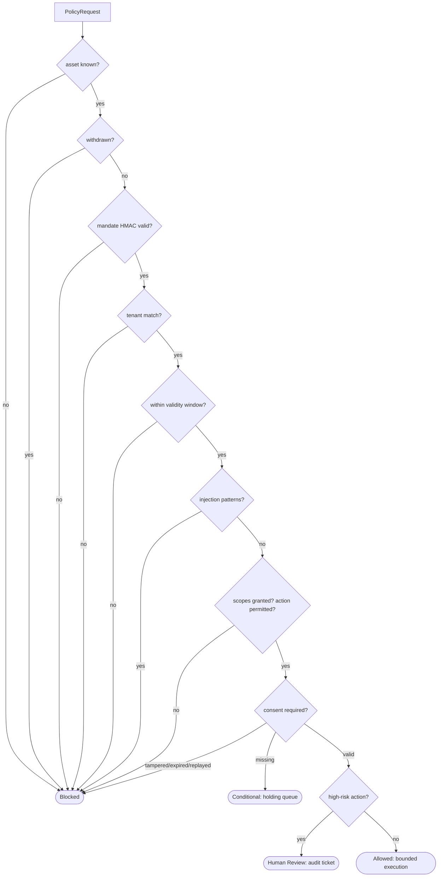

# MY3PAI Governed AI Core

Document Version: 0.2.0-beta
Release: `v0.2.0-beta`

Deterministic, rights-aware runtime for controlled AI content workflows, verifiable provenance, and reproducible contribution accounting.

The core is a four-state policy gateway placed out-of-band from any agent runtime. The agent requests; the gateway decides. The agent holds no reference to rule material, permission stores, or signing keys, and cannot inspect or modify its own permissions. Evaluation is fail-closed: any unknown asset, invalid mandate, scope mismatch, or internal error resolves to `Blocked` with an immutable audit entry.

## Setup

```bash
git clone https://github.com/kavehs87/MY3PAI-Governed-AI-Core.git
cd MY3PAI-Governed-AI-Core
make install
make test
make benchmark
```

Requirements: Python 3.12+, `k6` for benchmarks. Install: `pip install -e ".[dev]"`.

## Repository layout

```text
schemas/            Versioned immutable contracts (pydantic, frozen, extra=forbid)
src/policy/         Four-state gateway, HMAC consent tokens, injection screen, HTTP service
src/records/        Asset registry, mandate HMAC binding, hash-chained trace recorder
src/workflows/      Deterministic workflow engine (conditional/review holding queues)
src/connectors/     External connector registry with quarantine propagation
src/discovery/      Read-only tenant-scoped asset catalog
src/training/       Admission pipeline, Merkle-pinned build manifests
src/accounting/     Integer-only contribution ledger (cents, basis points)
src/explanations/   Display-only statements rendered from ledger state
src/observability/  NDJSON logs, OpenTelemetry-compatible span export
tests/              Pytest suites: gates, replay, runtime, property fuzz
benchmarks/         k6 gateway stress suite
evidence/           claims.csv, runs/<run-id>/ artifacts, benchmarks/k6_results.json
scripts/            Benchmark runner, evidence generator
```

## Four-state gateway



ASCII equivalent for terminals:

```text
request -> lookup -> withdrawn? -> mandate? -> tenant? -> window?
  -> injection? -> scope/action? -> consent? -> risk?
    Allowed | Conditional (awaiting consent token)
    | Blocked (terminal, audited) | Human Review (ticket REV-*)
```

Evaluation order is fixed (`src/policy/rules.py`, `RULE_VERSION 0.2.0`). The rule hash pins the exact rule text; every `PolicyDecision` carries `rule_version` and `rule_hash`, so replays attribute decisions to the code that produced them.

Boundary defenses, all verified in `tests/test_policy_gates.py` (29 cases):

- Expired rights, not-yet-valid windows, unknown assets, withdrawn assets: `Blocked`.
- Cross-tenant access, mandate tampering (scope, tenant, constraints), privilege escalation, out-of-constraint actions: `Blocked`.
- Prompt injection (`ignore previous instructions`, `bypass policy`, `reveal system prompt`, `jailbreak`, `override safety`, case variants): `Blocked`.
- Consent tokens (HMAC-SHA256, single-use nonces, constant-time comparison): missing yields `Conditional`; tampered, expired, wrong-scope, or replayed tokens yield `Blocked`.
- High-risk actions (`publish`, `train_export`, `bulk_export`): `Human Review` with a cryptographically generated `REV-*` ticket.

## Withdrawal quarantine protocol

Revocation is synchronous and monotonic. `AssetStore.withdraw()` flips the asset to withdrawn and invokes registered listeners before returning. Connectors flip to `Quarantined` and refuse reads until an explicit `acknowledge()` after revalidation. The gateway blocks on the very next evaluation; there is no polling interval.

```text
withdraw(asset) -> store marks withdrawn -> listeners fire synchronously
  -> connectors quarantine -> next gateway evaluation blocks
```

Measured revocation-to-block: in-process `0.02ms`; over HTTP (`POST /revoke` then probe) within the same process tick. Target `< 50ms`; k6 revoke checks assert `revoke_to_block_ms < 50` on every iteration.

## Schemas

| Contract | Location | Invariants |
| :--- | :--- | :--- |
| `AssetMetadata` | `schemas/asset.py` | SHA-256 content hash; HMAC mandate signature binding identity, scope, constraints, validity; `valid_until` strictly after `valid_from` |
| `PolicyDecision` | `schemas/policy.py` | Four-state enum; holding states require conditions or ticket; terminal states carry neither |
| `ExecutionTrace` | `schemas/trace.py` | `event_hash = SHA256(prev_hash \|\| canonical_json(body))`; monotonic ordering enforced |
| `LedgerRecord` | `schemas/ledger.py` | Integer cents and basis points only; float/bool input rejected at the boundary |

All models are frozen (`model_config = ConfigDict(frozen=True, extra="forbid")`) and pinned to `schema_version 0.2.0`.

## Training admission

`src/training/admission.py` admits an asset only when its mandate verifies under the custodian key, it is not withdrawn, tenant matches, the build time falls inside the validity window, and `train` is in usage constraints. `freeze()` emits an immutable `build_manifest.json`; `merkle_root` over sorted admitted content hashes pins the set. Any post-freeze substitution changes the root and fails verification.

## Accounting ledger

`src/accounting/ledger.py` uses integer minor units (cents) and integer basis points (`10000 = 100%`). Allocation is exact largest-remainder distribution with ties broken toward the lowest index, so replays are byte-identical. The single non-integer intermediate (partial-refund ratios) uses banker's rounding (`ROUND_HALF_EVEN`) with integer input and output. Covered edge cases: zero-revenue runs, dispute offsets, partial refunds, micro-cent ties.

`replay_run()` recomputes a run's records from raw inputs and compares serializations byte-for-byte. `tests/test_accounting_replay.py` posts 10,000 synthetic revenue events and asserts zero drift.

## Observability and evidence

- `src/observability/tracing.py`: NDJSON event logs (one JSON object per line, monotonic sequence) and OTel-compatible spans (`trace_id`, `span_id`, start/end nanoseconds).
- `evidence/claims.csv`: one row per claim with `claim_id`, `claim`, `verified_by`, `artifact`, `result`. Populated by `scripts/generate_evidence.py` (`make evidence`).
- `evidence/runs/<run-id>/`: `decisions.json`, `trace.json`, `events.ndjson`, `build_manifest.json`, `statement.txt` for the run that produced the claims.
- `evidence/benchmarks/k6_results.json`: machine-readable k6 summary produced by `scripts/run_benchmark.py` (`make benchmark`).

## Tests

```bash
make test            # full suite with coverage gate (>90%)
make test-gates      # Acceptance Gate 1: 29 adversarial/boundary cases
make test-replay     # 10,000-record deterministic replay
make lint            # ruff check + format check
make typecheck       # mypy --strict-equivalent (strict = true) over schemas, src, tests
```

Current state: 75 tests passing, total coverage 95% (policy gateway 100%, ledger 98%).

## Benchmarks

Suite: `benchmarks/k6_gateway_stress.js` against `src/policy/service.py` (stdlib HTTP, thread pool; no framework overhead). Reproduce with `make benchmark`, which boots the gateway, runs k6, and writes `evidence/benchmarks/k6_results.json`.

Validated run (recorded 2026-09-21, localhost):

| Load level | Requests | p50 | p95 | p99 | max | Target |
| :--- | ---: | ---: | ---: | ---: | ---: | :--- |
| Policy evaluation @ 200 RPS | 4,000 | 0.37ms | 0.55ms | 0.91ms | 2.89ms | p95 < 12ms |
| Policy evaluation @ 500 RPS | 10,001 | 0.34ms | 0.50ms | 1.15ms | 16.88ms | p95 < 12ms |
| Policy evaluation @ 1000 RPS | 15,001 | 0.27ms | 0.47ms | 1.35ms | 14.34ms | p95 < 12ms |
| Withdrawal propagation (8 iterations) | 8 revokes | — | — | — | revoke-to-block < 50ms each | < 50ms |

Failure rate `0.0` across 29,011 requests; all k6 thresholds passed. The gateway service exposes `GET /health`, `POST /evaluate`, and `POST /revoke` (which returns the measured `revoke_to_block_ms` for its own probe).

## Comparative matrix

| Dimension / Capability | **MY3PAI Governed AI Core** | **Guardrails AI** | **NeMo Guardrails** | **Open Policy Agent (OPA)** | **C2PA (Content Credentials)** | **Story Protocol** |
| :--- | :--- | :--- | :--- | :--- | :--- | :--- |
| **Primary Focus** | Rights-aware execution, IP custody, accounting | LLM input/output validation & hallucination checks | Dialogue flow & topical rails (Colang) | General-purpose cloud/infrastructure RBAC/ABAC | Media asset cryptographic provenance format | Web3 on-chain IP registry & licensing |
| **Enforcement Model** | Out-of-band 4-state deterministic gateway | In-process Python decorators / interceptors | In-process conversational guardrails | Sidecar / external daemon policy evaluation | Passive cryptographic metadata verification | Smart contract / blockchain transactions |
| **Asset Withdrawal Protocol** | **Real-time connector quarantine & runtime cutoff** | Not supported (model-level only) | Not supported | Requires policy redeployment | Not supported (metadata persists on file) | On-chain transaction state change |
| **Contribution Accounting** | **Deterministic ledger, exact integer allocation** | None | None | None | None | Web3 token distribution |
| **Agent Autonomy Decoupling** | **Hard isolation: Agent cannot alter permissions** | Agent can bypass if prompt alters flow | Bounded to Colang script flow | Decoupled from application runtime | N/A (Data specification only) | Decoupled via smart contract logic |
| **Audit Verification** | **Merkle manifests, replayable run evidence** | Run logs | Logging integrations | Decision logs | Digital signatures & certificate chains | Blockchain explorer / on-chain state |
| **Gateway Latency Overhead** | **< 12ms (p95 @ 500 RPS)** | High (50ms–300ms if LLM evaluators run) | Moderate (20ms–80ms) | Low (< 5ms) | N/A (Static asset check) | High (Block confirmation times) |

## CI/CD

- `.github/workflows/ci.yml`: ruff lint, ruff format check, `mypy` strict, pytest with coverage gate (>90%).
- `.github/workflows/benchmark.yml`: runs the k6 suite on PRs touching the gateway or benchmarks; uploads `k6_results.json` and `k6_summary.json`.
- `.github/workflows/audit.yml`: `pip-audit` on pushes, PRs, and weekly schedule.
