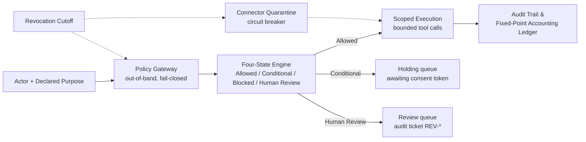

# MY3PAI Governed AI Core

[](https://github.com/kavehs87/MY3PAI-Governed-AI-Core/actions/workflows/ci.yml)


Maintainer: MY3PAI OÜ

A deterministic, rights-aware runtime and policy gateway for controlled AI content workflows, verifiable provenance, and reproducible contribution accounting.

## 1. The 60-second verification test

```bash
# 1. Clone
git clone https://github.com/kavehs87/MY3PAI-Governed-AI-Core.git
cd MY3PAI-Governed-AI-Core

# 2. Execute deterministic acceptance gate (< 45s execution time)
make verify

# 3. Hermetic Docker evaluation
docker compose up --build --exit-code-from test-runner
```

Expected result (also reproduced inside the container):

```text
............................................................             [100%]
60 passed in 1.38s
test-runner-1 exited with code 0
```

`make verify` runs the acceptance gate, ledger edge cases, schema contracts, and the service wire path: 60 tests, seed-fixed, no fuzz, no network. The full suite (`make test`: 75 tests, property fuzz, 10,000-record replay, coverage gate) and the load suite (`make benchmark`) are documented in `docs/evaluation-guide.md`.

## 2. Core architectural model and invariants



Request path: `PolicyRequest` (actor, declared purpose, tenant, scopes, consent tokens) enters the gateway; the four-state engine decides; only `Allowed` reaches scoped execution; every transition appends to a hash-chained trace and settles in the integer ledger. Revocation short-circuits the gateway and quarantines connectors on the same synchronous call (see `src/records/store.py`, `src/connectors/registry.py`).

Core invariants:

- *Hard agent decoupling:* agents cannot self-authorize, modify permissions, or alter audit logs. The gateway owns all rule material and store handles; the agent receives read-only decisions (`src/policy/gateway.py`).
- *Fail-closed default:* ambiguous mandates, unknown assets, or unacknowledged connectors yield `Blocked` or `Human Review`. Internal errors map to `Blocked` (`PolicyGateway.evaluate`, except-path).
- *Zero floating-point financials:* exact integer/basis-point arithmetic (`ROUND_HALF_EVEN` at the single non-integer intermediate) ensures byte-level financial replayability (`src/accounting/ledger.py`, `replay_run`).
- *Non-erasure revocation:* content withdrawal triggers immediate runtime quarantine rather than claims of model weight unlearning. Withdrawal is monotonic and synchronous (`AssetStore.withdraw`).

## 3. Competitive landscape: architectural boundary analysis

This is a boundary comparison, not a ranking. Each tool class is strong inside its own domain; the table states where those domains end and where this gateway operates.

| Dimension / Capability | **MY3PAI Governed Core** | **In-Process Guardrails** *(Guardrails AI, NeMo)* | **Infrastructure Policy** *(Open Policy Agent)* | **Asset Metadata Standards** *(C2PA)* | **Enterprise GRC Suites** *(Credo AI, OneTrust)* |
| --- | --- | --- | --- | --- | --- |
| **Execution Domain** | **Out-of-band runtime gateway** | In-process application interceptor | Sidecar daemon / host agent | Static file metadata layer | Post-hoc organizational audit platform |
| **Primary Scope** | **IP rights, content custody & financial ledgering** | Toxic text, output structure & hallucination | Cloud infra, API & Kubernetes RBAC/ABAC | Cryptographic media provenance | High-level risk management & compliance workflows |
| **Agent Autonomy Decoupling** | **Hard isolation (Cannot self-authorize)** | Weak (Vulnerable if prompt overrides logic) | Hard isolation | N/A (Data specification only) | N/A (Organizational layer) |
| **Asset Revocation Handling** | **Runtime connector quarantine (< 50ms)** | Unsupported (Requires model retraining) | Requires policy re-compilation / redeploy | Unsupported (Metadata persists on static file) | Manual policy adjustment workflow |
| **Contribution & Royalties** | **Fixed-point reproducible ledger** | None | None | None | None |
| **Integration Model** | **Consumes C2PA; controls agent tool access** | Wraps LLM client calls directly | Evaluates generic JSON payloads | Embedded in media file headers | Web platform & compliance documentation |
| **Latency Profile** | **< 12ms (p95 @ 500 RPS)** | 50ms–300ms (LLM-evaluator dependent) | < 5ms (In-memory Rego evaluation) | N/A (Static file verification) | N/A (Out-of-path) |

Notes: OPA's sub-5ms in-memory Rego evaluation is the reference point for raw policy speed; C2PA remains the correct layer for media provenance (this core consumes such metadata at admission rather than replacing it); Guardrails AI and NeMo address prompt toxicity and dialogue structure, which are complementary to rights evaluation.

## 4. Regulatory alignment matrix

- **EU AI Act Art. 14 (Human Oversight):** deterministic routing of edge cases to the `Human Review` state with tamper-evident reviewer logging (`schemas/policy.py`: `ReviewerEntry`; holding queue in `src/workflows/engine.py`).
- **EU AI Act Art. 53(1)(c) (GPAI Copyright Transparency):** pre-ingestion validation via `src/training/` verifying opt-out reservations and freezing Merkle admission manifests (`AdmissionPipeline.admit`, `BuildManifest`).
- **GDPR Art. 17 (Right to Erasure / Access Revocation):** dynamic connector quarantine halting downstream generation and retrieval without downtime (`ConnectorRegistry.quarantine`, `AssetStore.withdraw`).

Full mapping with file pointers: `docs/regulatory-alignment.md`.

## 5. Verified performance benchmarks

Suite: `benchmarks/k6_gateway_stress.js` against `src/policy/service.py` (stdlib HTTP, no framework overhead). Reproduce: `make benchmark`. Machine-readable results: `evidence/benchmarks/k6_results.json` (recorded 2026-09-21T11:00:17Z, localhost).

| Load level | Requests | Mean | p50 | p95 | p99 | Target |
| :--- | ---: | ---: | ---: | ---: | ---: | :--- |
| Policy evaluation @ 200 RPS | 4,001 | 0.46ms | 0.38ms | 0.59ms | 1.55ms | p95 < 12ms |
| Policy evaluation @ 500 RPS | 10,001 | 0.38ms | 0.32ms | 0.45ms | 1.27ms | p95 < 12ms |
| Policy evaluation @ 1000 RPS | 15,001 | 0.40ms | 0.27ms | 0.50ms | 2.04ms | p95 < 12ms |
| Withdrawal propagation | 8 revokes | — | — | — | all revoke-to-block < 50ms | < 50ms |

Failure rate `0.0` across 29,011 requests; all k6 thresholds passed. Check-level detail: `status 200` 29,011/29,011; `state Allowed` 29,002/29,003 (the single non-Allowed evaluation landed in the revocation window and was correctly `Blocked` — refuse-after-revoke); `blocked immediately` 8/8; `revoke-to-block < 50ms` 8/8.

Raw terminal output (tail of the recorded run):

```text
running (01m08.1s), 000/188 VUs, 29011 complete and 0 interrupted iterations
eval_200   ✓ [ 100% ] 00/25 VUs    20s             200.00 iters/s
eval_500   ✓ [ 100% ] 000/060 VUs  20s             500.00 iters/s
eval_1000  ✓ [ 100% ] 000/120 VUs  15s             1000.00 iters/s
withdrawal ✓ [ 100% ] 8 VUs        00m00.0s/10m0s  8/8 shared iters

+----------------+----------------+---------------+
| load level     | p50 (ms)       | p95 (ms)      |
+----------------+----------------+---------------+
| evaluate_200rps_ms |           0.38 |          0.58 |
| evaluate_500rps_ms |           0.32 |          0.45 |
| evaluate_1000rps_ms |           0.27 |          0.49 |
+----------------+----------------+---------------+
```

Method notes (arrival rates, warm-up, hardware caveats): `docs/benchmark-method.md`.

## 6. Evidence discipline and repository layout

Component maturity states used below: **Documented** (specified), **Implemented** (coded, typed, linted), **Executed** (covered by passing tests or benchmark runs), **Reviewed** (covered by CI gates on every push).

```text
schemas/            versioned immutable contracts ............ Implemented, Executed, Reviewed
src/policy/         4-state gateway, tokens, HTTP service .... Implemented, Executed, Reviewed
src/records/        registry, mandate binding, trace chains .. Implemented, Executed, Reviewed
src/workflows/      deterministic engine, holding queues ..... Implemented, Executed, Reviewed
src/connectors/     quarantine registry ...................... Implemented, Executed, Reviewed
src/discovery/      tenant-scoped catalog .................... Implemented, Executed, Reviewed
src/training/       admission, Merkle manifests .............. Implemented, Executed, Reviewed
src/accounting/     integer ledger ........................... Implemented, Executed, Reviewed
src/explanations/   display-only statements .................. Implemented, Executed, Reviewed
src/observability/  NDJSON logs, OTel-compatible spans ....... Implemented, Executed, Reviewed
tests/              75 tests, 95% total coverage ............. Executed, Reviewed
benchmarks/         k6 suite (200/500/1000 RPS + revocation) . Executed
evidence/           claims.csv + runs/<run-id>/ + k6 JSON .... Executed
```

Every claim in `evidence/claims.csv` carries `claim_id`, `claim`, `verified_by` (the exact test or benchmark that checks it), `artifact` (path under `evidence/runs/<run-id>/`), and `result`. Regenerate with `make evidence` (`scripts/generate_evidence.py`); latest run `run-20260921-110100-evidence`: 11/11 pass, including revocation-to-block `0.03ms` and ledger replay drift `0`.

Supporting documents: `docs/evaluation-guide.md` (evaluator walkthrough), `docs/architecture.md` (state machine, mandate binding, quarantine protocol), `docs/regulatory-alignment.md` (article-by-article mapping), `docs/benchmark-method.md` (harness, threats to validity).

## 7. Test, lint, and audit commands

```bash
make verify      # deterministic acceptance gate, 60 tests, seconds
make test        # full suite: 75 tests, fuzz, 10k replay, coverage gate >90%
make lint        # ruff check + format check
make typecheck   # mypy, strict = true, over schemas, src, tests
make benchmark   # boot gateway, run k6, write evidence/benchmarks/k6_results.json
make evidence    # operational run -> evidence/runs/<run-id>/ + claims.csv rows
```

CI (`.github/workflows/ci.yml`): lint, format check, strict typecheck, full suite with coverage gate — green on `main`. Benchmarks run on PRs touching the gateway (`benchmark.yml`); dependencies are audited on push, PR, and weekly schedule (`audit.yml`).
